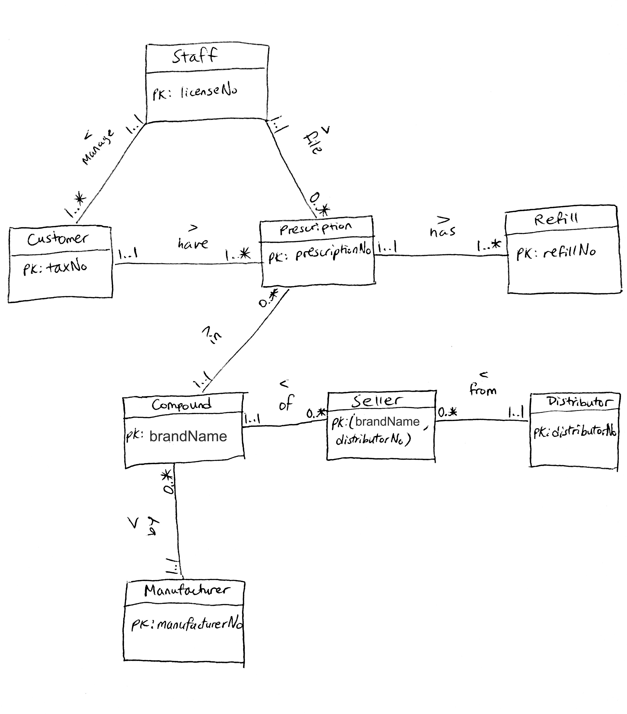

# Drug Prescription Refill Database   
by [Ty Feng](http://tyfeng.com/) 
#### <i> A database system for pharmacies to keep track of their customer's prescription and refill information. Implemented using embedded SQL in Java, and Oracle database. </i>
### Table of Contents
[Introduction](#Introduction)  
[Conceptual Design](#Conceptual-Design)  
[Identification of Entities and Attributes](#Identification-of-Entities-and-Attributes)    
[Identification of Cardinality and Participation Constraints](#Identification-of-Cardinality-and-Participation-Constraints)  
[Logical Design](#Logical-Design)  
[Refined Cardinality and Participation Constraints](#Refined-Cardinality-and-Participation-Constraints)   
[Entity Relationship (ER) Diagram](#Entity-Relationship-(ER)-Diagram)  
[Derivation of Relations](#Derivation-of-Relations)   
[Normalization and Verification](#Normalization-and-Verification)  
[Integrity Constraints](#Integrity-Constraints)  
[Implementation](#Implementation)   
[SQL and Embedded SQL Java Program](#SQL-and-Embedded-SQL-Java-Program)  
[Sample Queries](#Sample-Queries)  
[Conclusion](#Conclusion)  
### Introduction
Given the [case study of a drug prescription refill system](refill.pdf), [instructions](instruction.md) and the business needs of a pharmacy, I was tasked to create a relational database system that is able to solve those business needs. 
### <a name="#Conceptual-Design"></a>Conceptual Design 
#### Identification of Entities and Attributes
I firstly created a conceptual model with the following entities and their attributes:  
```
Prescription: prescriptionNo (primary key), dateFiled, compound, quantity, instructions, numOfRefills (optional), diagnosticID (optional), routeOfAdministration (optional), genericBool (optional)
Customer: taxNo (primary key), name, address, DOB, telephone, prescriptionNo
Staff: licenseNo (primary key), name, address
Compound: form, size, strength, primaryIngredient, secondaryIngredient, brandName, manufacturerNo, distributorNo, diagnosticID,  instructions, routeOfAdministration
		Composite primary key: (form, size, strength, primaryIngredient, manufacturerNo)
Manufacturer: manufacturerNo (primary key), name, address, compound
Distributor: distributorNo (primary key), name, address, compound
```
#### Identification of Cardinality and Participation Constraints
Then I identified the cardinality and participation constraints:  
```
Customer 1..1    --- have ---   1..* Prescription
Compound 1..1   --- in ---   1..*  Prescription
Compound 0..*    --- by ---   1..1 Manufacturer
Staff 1..*  --- file ---  0..* Prescription 
Staff 1..* --- manage --- 1..* Customer
```
### Logical Design 
#### Refined Cardinality and Participation Constraints
After some refinement and thinking based on the business needs of the pharmacy, I decided to add a ```refill``` entity for pharmacies to keep track of each customer's refill information. Based on normalization rules on cardinality and participation constraints, I updated those constraints: 
```
Customer 1..1    --- have ---   1..* Prescription
Compound 1..1   --- in ---   0..*  Prescription
Compound 0..*    --- by ---   1..1 Manufacturer
Distributor 0..*  --- sell ---  0..* Compound	
Staff 1..1  --- file ---  0..* Prescription 
Staff 1..1 --- manage --- 1..* Customer
Prescription 1..1 --- has ---  1..* Refill
```
Since Distributor sell Compound is a many to many \*:\* relationship, I created a new relation, ```Seller ( distributorNo (ref Distributor), brandName (ref Compound) )```. The new relationships involving Distributor and Compound become the following:
```
Distributor 1..1 --- from --- 0..* Seller
Seller 0..* --- of --- 1..1 Compound
```
The primary key of Distributor and the primary key of Compound are copied into Seller as foreign keys, forming a composite primary key for Seller. 
```
Seller (distributorNo (ref Distributor), brandName (ref Compound))
(Primary Key: distributorNo, brandName)
```
All the other relationships in my design are one to many 1:* relationships. I have copied the primary keys of the parent entity to the child entity as foreign keys. 
#### Entity Relationship (ER) Diagram
Based on the above information, I created an ER diagram: \
 
#### Derivation of Relations
Then I derived those relations and modeled its logical design with data types and constraints, including primary key, foreign key, and general constraints.  
```
Prescription: prescriptionNo (primary key), dateFiled, quantity, instructions, brandName (ref Compound), diagnosticID, routeOfAdministration, genericOrWritten, licenseNo (ref Staff), taxNo (ref Customer) 
Customer: taxNo (primary key), name, address, DOB, telephone, prescriptionNo (ref Prescription), licenseNo (ref Staff)  
Staff: licenseNo (primary key), name, address
Compound: brandName (primary key), diagnosticID, form, size, strength, primaryIngredient, secondaryIngredient, manufacturerNo (ref Manufacturer), instructions, routeOfAdministration, genericSubstitute
	Manufacturer: manufacturerNo (primary key), name, address, brandName (ref Compound)
Distributor: distributorNo (primary key), name, address
Seller: distributorNo (ref Distributor), brandName (ref Compound) 
(Primary Key: distributorNo, brandName)
Refill: refillNo (primary key), prescriptionNo (ref Prescription), date, price
```
#### Normalization and Verification
Those relations are normalized from 2NF to BCNF.   
```
Prescription: prescriptionNo (primary key), dateFiled, quantity, instructions, routeOfAdministration, genericOrWritten, brandName (ref Compound), diagnosticID, licenseNo (ref Staff), taxNo (ref Customer) 
```
All the non-primary key attributes are functionally dependent on the primary key prescriptionNo. It is already normalized to BCNF.
```
Customer: taxNo (primary key), name, address, DOB, telephone, prescriptionNo (ref Prescription), licenseNo (ref Staff)  
```
Customer is already normalized to BCNF. All non-primary attributes are fully functionally dependent on the primary key, and no other dependencies are present. 
```
Staff: licenseNo (primary key), name, address
```
Staff is already normalized to BCNF. Attributes name and address are fully functionally dependent on the primary key, and no other dependencies are present. 
```
Compound: diagnosticID, form, size, strength, primaryIngredient, secondaryIngredient, brandName (primary key), manufacturerNo (ref Manufacturer), instructions, routeOfAdministration, genericSubstitute
```
Compound is already normalized to BCNF. All non-primary attributes are fully functionally dependent on the primary key, and no other dependencies are present. 
```
Manufacturer: manufacturerNo (primary key), name, address, brandName(ref Compound)
```
Manufacturer is already normalized to BCNF. All non-primary attributes are fully functionally dependent on the primary key, and no other dependencies are present. 
```
Distributor: distributorNo (primary key), name, address
```
Distributor is already normalized to BCNF. All non-primary attributes are fully functionally dependent on the primary key, and no other dependencies are present. 

```
Seller: distributorNo (ref Distributor), brandName (ref Compound) 
(Primary Key: distributorNo, brandName)
```
Seller is already normalized to BCNF. 
 
```
Refill: refillNo (primary key), prescriptionNo (ref Prescription), date, price  
```
Refill is already normalized to BCNF. All non-primary attributes are fully functionally dependent on the primary key, and no other dependencies are present. 
#### Integrity Constraints
Then I defined the integrity constraints as well as data types for each attribute in each entity.  
Since Oracle does not have boolean data type, I am using the CHAR data type with a length of 1 and the only inputs allowed are ‘Y’ or ‘N’. For the attribute genericOrWritten in Prescription table, ‘Y’ means generic, and ‘N’ means written. For the attribute genericSubstitute in Compound table, ‘Y’ means the compound is a generic substitute, and ‘N’ means otherwise.  

| Entity | Attributes | Data type, length | Null | 
| ------ | ---------- | ----------------- | ---- | 
| Prescription  |  prescriptionNo (primary key) | varchar 24 | No |  
|               |  dateFiled                    | date       | No |  
|		|  quantity			| integer  | No |  
|		|  instructions 		| varchar 240 | No |  
|		|  routeofAdministration	| varchar 50 | No |  
| 		| genericOrWritten 		| char 1 ('Y','N') | No |  
|		| brandName (ref Compound) 	| varchar 20 | No |  
|		| diagnosticID (alternate key) | varchar 20 | No |  
| 		| licenseNo (ref Staff) 	| varchar 20 | No |  
| 		| taxNo (ref Customer)		| varchar 12 | No | 
| Customer | taxNo (primary key) | varchar 12 | No | 
| | name | varchar 30 | No | 
| | address | varchar 50 | No | 
| | DOB | date | No | 
| | telephone | varchar 16 | No | 
| | prescriptionNo (ref Prescription) | varchar 24 | No | 
| | licenseNo (ref Staff) | varchar 20 | No | 
| Staff | licenseNo (primary key) | varchar 20 | No | 
| | name | varchar 30 | No | 
| | address | varchar 50 | No | 
| Compound | brandName (primary key) | varchar 20 | No | 
| | diagnosticID | varchar 20 | No | 
| | form | varchar 20 | No | 
| | size | varchar 20 | No | 
| | strength | varchar 20 | No | 
| | primaryIngredient | varchar 40 | No | 
| | secondaryIngredient | varchar 40 | No | 
| | manufacturerNo (ref Manufacturer) | varchar 10 | No | 
| | instructions | varchar 240 | No | 
| | routeofAdministration | varchar 50 | No | 
| | genericSubstitute | char 1 ('Y','N') | No | 
| Manufacturer | manufacturerNo (primary key) | varchar 10 | No | 
| | name | varchar 20 | No | 
| | address | varchar 50 | No | 
| | brandName (ref Compound) | varchar 20 | No | 
| Distributor | distrbutorNo (primary key) | varchar 10 | No | 
| | name | varchar 20 | No | 
| | address | varchar 50 | No | 
| Seller | distributorNo (ref Distributor) | varchar 10 | No | 
| | brandName (ref Compound) | varchar 20 | No |
| | primary key: (distributorNo, brandName) | | 
| Refill | prescriptionNo (ref Prescription, primary key)  | varchar 24 | No | 
| | refillNum | integer | No | 
| | date | Date | No | 
| | price | integer | No | 
| | CONSTRAINT refillNum CHECK (refillNum >= 1) | | 


### Implementation
#### SQL and Embedded SQL Java Program
Then I created those tables from my logical design in SQL in my Oracle database. The script used to create tables are in the ```createtable.sql``` file. I inputted some sample data according to constraints established earlier, and the script for inserting data to the database is in the ```insert.sql``` file. After that, I implemented an embedded SQL program in Java with a command-line user interface that allows users to query, update, delete, and insert into the database. The .java files that make up the embedded SQL Java program are: 
```
Main.java
Menu.java
QueryManager.java
UI.java
```
To run, simply type ```make run``` as the ```Makefile``` script would handle the compilation process. \
#### Sample Queries
My database system is able to handle the following sample queries. 
1. List all the active prescriptions of a customer \
 
2. List the details of all the distributors and manufacturers for a compound 
 
3. List the details of a compound
 
4. List the total number of active prescriptions and their detailed information
 
5. List the number of refills left and the expiration date of a prescription 
 
6. List all the prescriptions that have compounds not appropriate for the conditions being treated 
 
7. List all generic substitutions for a compound  
In my logical design, I set genericSubstitute as an boolean attribute of a compound. To find generic substitutes, I assumed that the brand names for the compounds are different, since they could be manufactured by different companies, but the primary ingredient should be the same, and is what matters to treat a condition. Therefore, I am using primaryIngredient as the attribute to find generic substitutes for a non-generic compound.  
 
8. Update the address information of a physician
 
9. Delete all prescriptions that are more than five years old  
Since the DATE data type uses the number of dates, I computed five years as days by multiplying 5 to 365 days, which is 1825 days.
 
 
10. Insert a new prescription for a new customer
 

### Conclusion
In this project I was tasked to create a database system for a pharmacy that has needs to keep track of refills of prescriptions of their customers, as well as the corresponding compound information for each prescription. In the conceptual design I identified the entities and their attributes and developed a rudimentary ER diagram to show the relationships. In the logical design I updated the ER diagram after thinking about the scenarios when customers need to keep track of each refill information, and for that I have added the refill table. After deriving the relationships based on the ER diagram, I normalized each relation to BCNF. I then checked my logical model against the sample queries provided to ensure that my model can accommodate all of those tasks. Lastly, I defined the data types and constraints of each relation, including primary keys, foreign keys, and alternate keys.  
In the implementation stage, I chose java as the language to implement an embedded sql program. In the command-line user interface I tried to provide as much information as possible for the user when they are engaging in potentially dangerous tasks such as deleting entries. I showed them all the information that will be deleted before executing such query.   
The general assumptions I have made were that brand names for different compounds are different, and therefore can be used as a primary key to uniquely identify compounds. However, to find generic substitutes for a compound I assumed that what matters is the primary ingredient in the compound. Thus, I used the primary ingredient of the given compound to find other compounds that share the same primary ingredient and that are classified as generic substitutions. I also assumed that users would input data correctly when inserting or updating entries. However, bad inputs would not crash the program because the database would reject such entry because of the constraints made. 

